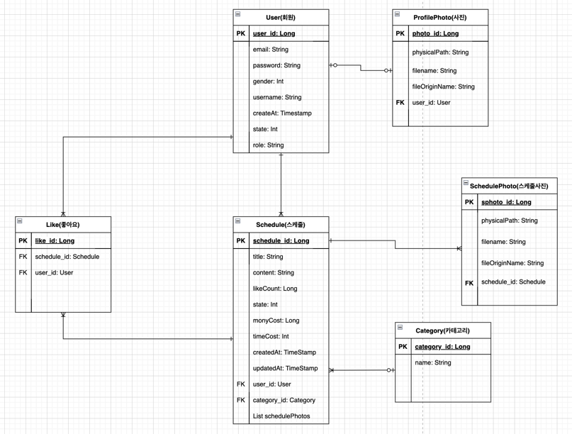

# scheduleShare

## 🖥 프로젝트 소개
주말 스케줄 공유 서비스 프로젝트 입니다.

시연 영상: https://www.youtube.com/watch?v=v8lKyQWaRMg
 

## 🗓 개발 기간
* 23.01.31 ~ 23.03.30

## 🧑‍🤝‍🧑 팀 멤버
 🧑‍💻 김상우(kimsangwoo66)
+ 엔터티 설계, 통합 및 형상관리, 로그인, 회원가입, 마이페이지, 메인페이지, 스케줄등록, 스케줄 상세, 마이 스케줄함 페이지, 하트 스케줄함 페이지

 👩‍💻 백소영(Soiiii)
+ 스케줄 등록 - 카테고리 선택, db 테이블 설계, wbs 관리 
 

## 📚 기술 스택

#### 프론트 엔드
+ Html

+ Css

+ JavaScript(Jquery)

+ Jsp

#### 백엔드
+ Spring Boot

+ Spring Data JPA

+ Spring Security

+ Mysql 

## 🛠 개발 환경

+ IntelliJ
+ Mysql WorkBench

## ▶ 주요 기능

#### 로그인
- 아이디 & 비밀번호 검증
- 로그인 시 쿠키 및 세션 생성

#### 회원가입
- 아이디 중복 체크
- 닉네임 중복 체크
- 비밀번호 확인

#### 마이 페이지
- 마이 이미지 수정

#### 메인 페이지
- 스케줄 페이징
- 스케줄 슬라이드

#### 스케줄 등록
- 카테고리 선택
- 등록 완료

#### 스케줄 상세
- 스케줄 수정
- 스케줄 삭제
- 하트 추가
- 하트 감소

#### 마이 스케줄함 페이지
- 스케줄 페이징

#### 하트 스케줄함 페이지
- 스케줄 페이징

#### 엔터티 설계

## 📝 회고

Ajax로 동시에 2개의 contenttype 객체 postmapping으로 요청
* https://deep-longship-e47.notion.site/Ajax-2-contenttype-postmapping-e125191cc3934f44848fac74b19d09fa

builder 패턴 사용
* https://deep-longship-e47.notion.site/builder-cecaa8afce294c2d9666de2e64790b6d

schedule, schedulePhoto 엔터티 연관관계 수정 후 스택 오버플로우 에러
+ https://deep-longship-e47.notion.site/schedule-schedulePhoto-ccf1cabdf93f4a589c1b13a0a1a8a114

메인화면 케러셀 슬라이드 사용
+ https://deep-longship-e47.notion.site/71ecaadac9464fadbfd7fb183c6c9b48

jpa insert 할때 default 값 적용 불가
+ https://deep-longship-e47.notion.site/jpa-insert-default-2081ad9d198747bb9a95e24e8bc1d2d7

spring secuirty로 로그인 하여 JSSESSION 쿠키 생성
+ https://deep-longship-e47.notion.site/spring-secuirty-JSSESSION-768ef20be40e4c7381802696102c52f9

스케줄 수정 구현
+ https://deep-longship-e47.notion.site/1e16a73e90664978a7102b1b6eccc6cc

스케줄 삭제 구현
+ https://deep-longship-e47.notion.site/7b339a18c8bb4d9085f5029a2b7979cf

 

## config

서버에 설정값을 추가해줘야 합니다.

#### [Application.properties]
####server external path setting .. for upload imgs##

resource.path=" 이미지를 저장할 서버 경로 "

img.path=/img/**

#### [Mysql]
DB에 수동으로 직접 값 insert 필요

INSERT INTO recard.Category (category_id,name) VALUES
(1,'수업'),
(2,'팀플'),
(3,'식사'),
(4,'음주'),
(5,'일'),
(6,'데이트'),
(7,'스터디'),
(8,'동아리'),
(9,'운동'),
(10,'여행');
